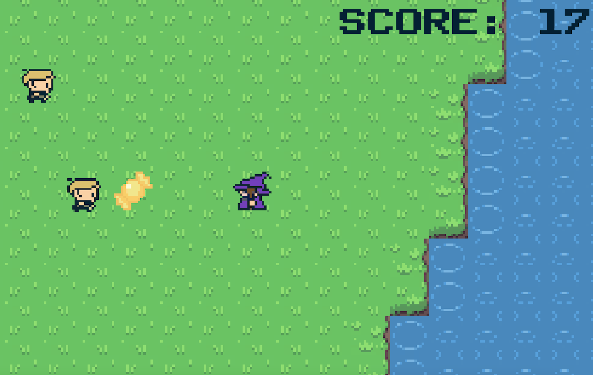

# Trick-or-Treat-Island
Trick or Treat Island is a low-stakes 2d arcade game where you give candy to trick-or-treaters. They are quite pushy and will chase you until they get candy. Made with a 7-day time limit for the QGDS Halloween game jam, and awarded 3rd place! Created with C# and Unity Game Engine.

## Gameplay
You are a wizard on a vast grassy island. You don't know how or why you got here, but dozens of people keep chasing you for candy! Move around the island and share your candy with the incoming hoards of trick-or-treaters.

  

## Controls
Movement: WASD or Arrow keys
 
Throw candy: Z key

## Where to play it?
Windows and Mac versions are available for download on the game's [itch.io page](https://svaldes04.itch.io/trick-or-treat-island).
